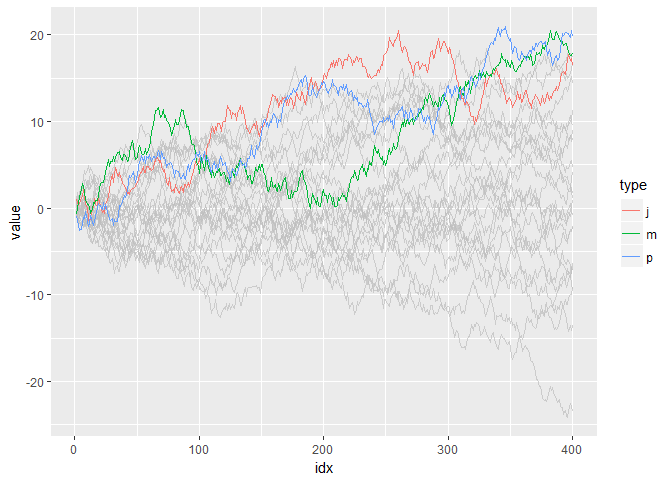

Suppose we have a data that has too many series like this:

    set.seed(2)
    d <- purrr::map_dfr(
      letters,
      ~ data.frame(idx = 1:400,
                   value = cumsum(runif(400, -1, 1)),
                   type = .,
                   stringsAsFactors = FALSE))

For such data, it is almost impossible to identify a series by its
colour as their differences are so subtle.

    library(ggplot2)

    ggplot(d) +
      geom_line(aes(idx, value, colour = type))

So, I am motivated to filter data and map colour only on that, using
dplyr:

    library(dplyr, warn.conflicts = FALSE)

    d_filtered <- d %>%
      group_by(type) %>% 
      filter(max(value) > 20) %>%
      ungroup()

    ggplot() +
      # draw the original data series with grey
      geom_line(aes(idx, value, group = type), data = d, colour = alpha("grey", 0.7)) +
      # colourise only the filtered data
      geom_line(aes(idx, value, colour = type), data = d_filtered)

But, what if I want to change the threshold in predicate
(`max(.data$value) > 20`) and highlight other series as well? It's a bit
tiresome to type all the code above again every time I replace `20` with
some other value.

**gghighlight** package provides two functions to do this job.
`gghighlight_line()` is the one for lines. The code equivalent to above
(and more) is bellow:

    library(gghighlight)

    gghighlight_line(d, aes(idx, value, colour = type), max(value) > 20)

